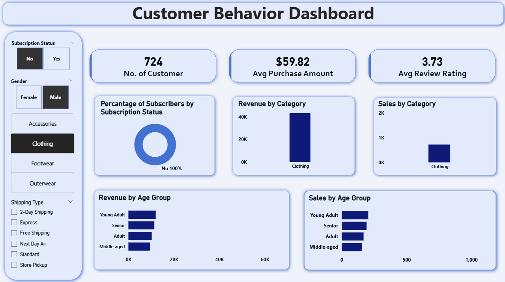

# 📊 Customer Behavior Analysis

## 📌 Project Overview
This project analyzes customer shopping behavior to extract actionable insights that support data-driven business decisions.  
It demonstrates an end-to-end data analytics workflow — from raw data processing and exploration to SQL analysis and interactive dashboard creation.

The analysis focuses on understanding customer purchasing patterns, spending behavior, and key trends that can help improve marketing strategies, customer retention, and overall business performance.

---

**Dashboard Highlights:**
- Identifies high-value customers based on total spend
- Tracks purchase frequency across customer segments
- Highlights top-performing product categories

---

## 📂 Dataset
- **Format:** CSV  
- **Description:** Customer shopping and transaction-level data  
- **Key Attributes Include:**
  - Customer demographics
  - Purchase history
  - Spending patterns
  - Product and transaction details

The dataset was cleaned and prepared using Python before further analysis and visualization.

---

## 🛠️ Tools & Technologies
- **Python**
  - Data loading, cleaning, and exploratory data analysis (EDA)
  - Libraries: Pandas, NumPy, Matplotlib, Seaborn
- **SQL (MySQL)**
  - Querying and analyzing structured customer data
- **Power BI**
  - Interactive dashboard development and visualization
- **AI Tools**
  - Assisted in report writing and presentation creation
- **Microsoft PowerPoint**
  - Executive-level presentation of insights

---

## 🔍 Analysis Workflow
1. **Data Loading**
   - Imported raw CSV data into Python

2. **Exploratory Data Analysis (EDA)**
   - Analyzed data distributions and trends  
   - Identified customer behavior patterns and outliers  

3. **Data Cleaning**
   - Handled missing values  
   - Corrected data types  
   - Removed inconsistencies and duplicates  

4. **SQL Analysis (MySQL)**
   - Performed customer segmentation  
   - Analyzed purchasing frequency and spending trends  
   - Extracted key business metrics  

---

## 📊 Power BI Dashboard
An interactive Power BI dashboard was created to visualize:
- Customer spending trends  
- Purchase frequency  
- Category-wise performance  
- Key customer segments  

The dashboard allows stakeholders to explore insights dynamically using filters and visuals.

---

## 📈 Key Insights
- Identified high-value customers based on spending behavior  
- Discovered trends in purchase frequency and customer preferences  
- Highlighted top-performing product categories  
- Provided data-driven recommendations for improving customer engagement  

---

## 📁 Project Files
- `Customer_Shopping_Behavior_Analysis.ipynb` – Python analysis & EDA  
- `customer_shopping_behavior.csv` – Raw dataset  
- `customer_behavior_analysis.sql` – MySQL queries  
- `Customer Behavior Analysis.pbix` – Power BI dashboard  
- `Customer Shopping Behavior Analysis.pdf` – Final report  
- `Customer-Shopping-Behavior-Analysis.pptx` – Presentation deck  

---

## 🚀 Conclusion
This project demonstrates practical experience with Python, SQL, and Power BI while applying data analytics techniques to a real-world business problem.  
It highlights the ability to transform raw data into meaningful insights and communicate results effectively through dashboards and reports.

---

## 📬 Contact
If you’d like to discuss this project or collaborate, feel free to connect with me on LinkedIn or reach out via GitHub.
- **LinkedIn:** [[linkedin.com/in/yourname](https://www.linkedin.com/in/abdulml87/)]
- **GitHub:** [github.com/yourusername](https://github.com/Abdul-malik109)
